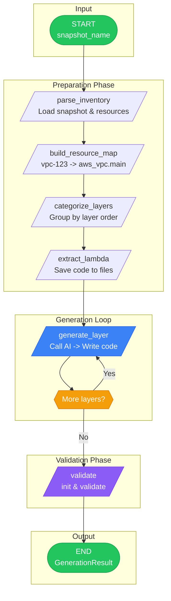

# IaC Generation

Generate Infrastructure as Code from your inventory snapshots using AI. Supports Terraform, CDK TypeScript, and CDK Python. Choose between AWS Bedrock (default) or OpenAI as your LLM provider.

## Quick Start

=== "Terraform"

    ```bash
    awsinv generate terraform my-snapshot
    ```

=== "CDK TypeScript"

    ```bash
    awsinv generate cdk-typescript my-snapshot
    ```

=== "CDK Python"

    ```bash
    awsinv generate cdk-python my-snapshot
    ```

## Options

```bash
# Generate from a JSON/YAML export file
awsinv generate terraform --from-file inventory.json
awsinv generate terraform --from-file export.yaml --output ./infra

# Specify output directory and project name
awsinv generate cdk-typescript my-snapshot --output ./my-cdk-app

# Use different Bedrock model or region
awsinv generate terraform my-snapshot \
  --model-id anthropic.claude-opus-4-20250514-v1:0 \
  --region us-west-2

# Use OpenAI instead of Bedrock
awsinv generate terraform my-snapshot --provider openai --openai-api-key sk-...

# Use a specific OpenAI model
awsinv generate terraform my-snapshot \
  --provider openai --openai-model gpt-4o --openai-api-key sk-...

# Use an OpenAI-compatible endpoint (e.g., Azure OpenAI)
awsinv generate terraform my-snapshot \
  --provider openai --openai-base-url https://your-endpoint/v1 --openai-api-key your-key

# Dry run (show what would be generated)
awsinv generate terraform my-snapshot --dry-run
```

## With Guardrails

```bash
# Generate with built-in guardrails
awsinv generate terraform my-snapshot --guardrails

# Use a custom policy file
awsinv generate terraform my-snapshot --guardrails --guardrails-policy ./policy.yaml

# Strict mode + environment-specific overrides
awsinv generate terraform my-snapshot --guardrails --guardrails-strict --guardrails-env production
```

See [Guardrails Overview](../guardrails/index.md) for details.

## From a Pattern

Generate IaC from a reusable architecture pattern instead of a live snapshot:

```bash
# Generate Terraform from a pattern in the library
awsinv patterns generate-iac three-tier-web-app --format terraform

# Generate CDK from a pattern YAML file
awsinv patterns generate-iac ./my-pattern.yaml --format cdk-typescript

# With guardrails applied
awsinv patterns generate-iac three-tier-web-app --format terraform --guardrails
```

See [Infrastructure Patterns](../patterns/index.md) for details on creating and managing patterns.

## How It Works



## Layer Order

Resources are generated in dependency sequence:

| Order | Layer | Resources |
|-------|-------|-----------|
| 1 | Network | VPCs, Subnets, Route Tables, Gateways |
| 2 | Security | Security Groups, NACLs, WAF, KMS |
| 3 | IAM | Roles, Policies, Instance Profiles |
| 4 | Data | RDS, DynamoDB, ElastiCache |
| 5 | Storage | S3, EFS |
| 6 | Compute | EC2, Lambda, ECS, EKS |
| 7 | LoadBalancing | ALB, NLB, Target Groups |
| 8 | Application | API Gateway, AppRunner |
| 9 | Messaging | SQS, SNS, EventBridge |
| 10 | Monitoring | CloudWatch, CloudTrail |
| 11 | DNS | Route53, CloudFront |

## Output Structure

=== "Terraform"

    ```
    ./terraform/
    +-- main.tf              # Provider configuration
    +-- variables.tf         # Input variables
    +-- outputs.tf           # Output values
    +-- layer_01_network.tf  # VPCs, subnets, gateways
    +-- layer_02_security.tf # Security groups, ACLs
    +-- layer_03_iam.tf      # Roles, policies
    +-- ...
    ```

=== "CDK TypeScript"

    ```
    ./cdk-app/
    +-- bin/app.ts           # Entry point with stack imports
    +-- lib/
    |   +-- network_foundation_stack.ts
    |   +-- security_groups_stack.ts
    |   +-- iam_resources_stack.ts
    |   +-- ...
    +-- package.json
    +-- tsconfig.json
    +-- cdk.json
    ```

=== "CDK Python"

    ```
    ./cdk-app/
    +-- app.py               # Entry point with stack imports
    +-- stacks/
    |   +-- __init__.py
    |   +-- network_foundation_stack.py
    |   +-- security_groups_stack.py
    |   +-- ...
    +-- requirements.txt
    +-- setup.py
    +-- cdk.json
    ```

## Requirements

=== "Bedrock (default)"

    - AWS credentials with Bedrock access (uses your configured AWS profile)
    - Default model: `anthropic.claude-opus-4-20250514-v1:0` (Claude Opus 4)

=== "OpenAI"

    - OpenAI API key (set via `--openai-api-key` or `AWSINV_OPENAI_API_KEY`)
    - Default model: `gpt-4o`
    - Install the optional dependency: `pip install aws-inventory-manager[openai]`

**Common requirements:**

- For CDK TypeScript: Node.js 18+ and npm (for validation)
- For CDK Python: Python 3.8+ (for validation)

!!! note
    IaC generation requires the `langgraph` optional dependency: `pip install aws-inventory-manager[generate]`

!!! tip
    All LLM provider settings can be configured via environment variables. See [Environment Variables](../configuration/environment-variables.md#llm-provider) for details.
